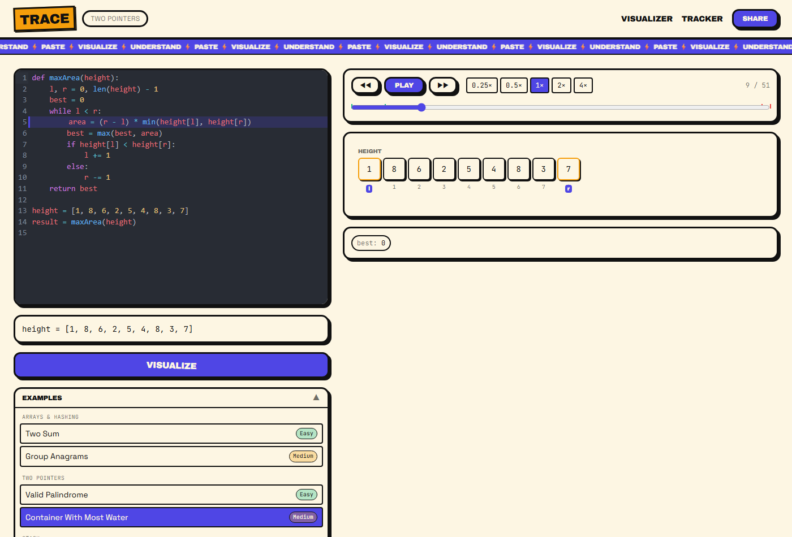

# TRACE

**Paste Python. Watch it run.**

Trace is a web app for building intuition on DSA (data structures & algorithms) patterns. Paste real Python, press Visualize, and watch it execute step by step — real execution, real animation, synced to a highlighted line in the editor. Not an LLM guessing what your code does; the visualization is driven entirely by actually running your code.



Live at **[tracepy.vercel.app](https://tracepy.vercel.app)**.

## What it does

- **Real execution.** Python runs in your browser via [Pyodide](https://pyodide.org/) (CPython compiled to WASM) inside a Web Worker, traced line-by-line with `sys.settrace`. Nothing about the animation is inferred or hallucinated.
- **18 topics, 36 examples.** Every NeetCode-style roadmap topic — Arrays & Hashing through Advanced Graphs — with two hand-verified examples apiece, ready to play instantly with no LLM call.
- **Paste your own code.** Arbitrary Python goes through a small LLM preprocessing pass that normalizes structure and labels variables (never generates the trace itself — see architecture below).
- **11 renderers**, one per data-structure shape: array, hashmap, stack, linked list, tree, trie, graph, grid, heap, interval, and bit rows — each with its own animation language (reads pulse, writes flash, swaps arc, removals fade with weight).
- **Full playback control**: play/pause, step forward/back, 0.25×–4× speed, instant scrub on traces of any length.
- **Share links** that reproduce the exact code + trace on any machine, and a personal problem **tracker** (localStorage by default; optionally synced to an account — see below).

## Architecture: preprocess → trace → render

```
 paste code                 built-in example
      │                            │
      ▼                            │ (skips preprocessing —
 POST /api/preprocess               ships hand-verified meta)
      │                            │
      ▼                            │
 Gemini normalizes code,           │
 classifies topic, labels          │
 variable roles — text in,         │
 text out, never executes it       │
      │                            │
      └─────────────┬──────────────┘
                     ▼
         Web Worker: Pyodide + a
         sys.settrace harness runs
         the code for real, snapshotting
         locals on every line/call/return
                     │
                     ▼
           TraceStep[] (JSON-safe,
           serialized structures —
           lists, dicts, linked lists,
           trees, tries, opaque reprs)
                     │
                     ▼
     Zustand trace store + playback engine
                     │
                     ▼
      Renderer registry picks renderers by
      variable role + serialized type, stacks
      them (primary + secondary), and drives
      Framer Motion off diffs between steps
```

The LLM never invents an execution step — it only transforms source text and labels variables. The trace is always the real output of running real Python.

## Stack

| Layer | Choice |
|---|---|
| Framework | Next.js 16 (App Router) + TypeScript |
| Styling | Tailwind CSS v4, hand-rolled neobrutalist design tokens |
| Animation | Framer Motion |
| Editor | CodeMirror 6 |
| Python execution | Pyodide, in a Web Worker |
| State | Zustand |
| LLM preprocessing | Google Gemini (`@google/genai`) |
| Auth + cloud sync | Supabase (`@supabase/ssr`) — fully optional, see below |
| Share links | `lz-string` URL compression |

## Local setup

```bash
npm install
npm run dev
```

Open [http://localhost:3000](http://localhost:3000). The 36 built-in examples work immediately with zero env vars — Pyodide loads lazily on first Visualize, and built-in examples ship hand-authored metadata so they never touch the LLM route.

### Environment variables

All optional in the sense that the app runs and every built-in example works with none of them set. Create `.env.local` (gitignored) at the repo root:

| Variable | Required for | Notes |
|---|---|---|
| `GEMINI_API_KEY` | Pasting arbitrary (non-built-in) Python | Server-only, never exposed to the client. Without it, `/api/preprocess` returns a designed error card; built-in examples are unaffected. |
| `NEXT_PUBLIC_SUPABASE_URL` | Account sign-in + cloud tracker sync | Both Supabase vars are optional together — set neither and the app behaves exactly as if the feature doesn't exist (tracker stays localStorage-only, sign-in UI hides entirely). |
| `NEXT_PUBLIC_SUPABASE_ANON_KEY` | Account sign-in + cloud tracker sync | Public by design (anon key) — actual data access is enforced by Postgres Row Level Security, see `supabase/setup.sql`. Never put the service-role key anywhere in this app. |

### Optional: enabling accounts + cloud tracker sync

1. Create a project at [supabase.com](https://supabase.com).
2. Run `supabase/setup.sql` in the project's SQL editor (idempotent — safe to re-run).
3. Enable Google OAuth and/or email magic links under Authentication → Providers.
4. Set the two `NEXT_PUBLIC_SUPABASE_*` vars locally and on your deployment.

No code changes needed — the moment those two vars are present, `/signin`, the TopBar account menu, and the cloud tracker all activate.

## Deploy

Deployed on Vercel. `vercel --prod` from the repo root (or connect the GitHub repo for automatic deploys on push to `main`). Set the environment variables above in the Vercel project settings — same table applies.

## Project structure

```
src/app/              routes: / (landing), /app (workspace), /tracker, /signin, /v (share links)
src/components/       renderers/, tracker/, landing/, chrome (TopBar, ControlDeck, ...)
src/lib/
  trace/              serialization types, diffing, format helpers
  renderers/           layout/geometry helpers per renderer
  motion/              shared animation timing (speed/step/scrub-aware)
  store/               zustand stores (trace, tracker, auth)
  examples/            the 36 hand-authored built-in examples
  preprocess/          LLM prompt + schema + rate limiting
  supabase/            client/server/middleware factories, all env-gated
  tracker/             localStorage + Supabase persistence
src/workers/           the Pyodide tracer harness
supabase/setup.sql     tracker_entries DDL + RLS policies
```
